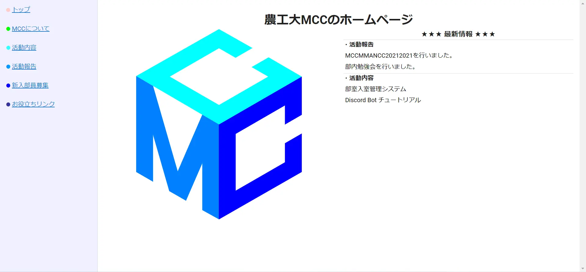
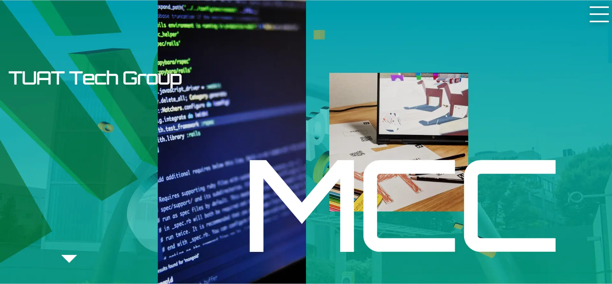

MCC のホームページをリニューアルしたのでご報告

## 旧ホームページの状況

> 古典的な WEB サイトを、現代のフロントエンド・フレームワークを駆使して書き直すコンセプトです。 古臭そうな見た目をしてる割に、がっつりレスポンシブ・SPA で動きます。

とのこと。(中身は Nuxt2 でした)

## 新しいホームページ

2022 年 11 月下旬、文化祭も終わり落ち着き始めたころ、制作を開始しました。

とにかく見た目を頑張った！

## おわりに

- 各ページのデザインをもっと良くする。
- 記事をもっと増やす（文化祭のこととかもそう）
- 記事を追加しやすいシステムにする

書くことないな...

## その他

- ソースコードは[こちら](https://github.com/tuatmcc/mcc-website)
- 技術的な話はブログの方に書く予定です
